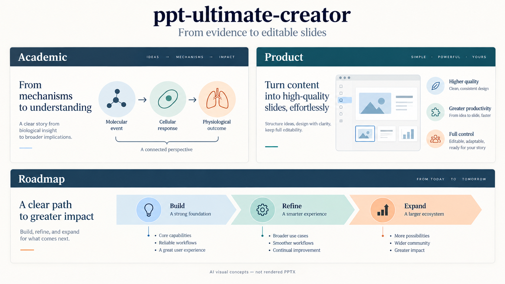

# ppt-ultimate-creator

[中文](README.zh-CN.md) | English

A Codex skill for creating editable PowerPoint presentations from directories, documents, papers, web pages, or outlines. Display name: **终极ppt生成**.

## Visual examples



AI-generated visual concepts illustrating possible directions, not rendered PPTX output or bundled templates. Content, style and editable objects are created and checked for each actual task.

The initial conversation asks whether you have a reference template. When a matching PPTX/POTX exists, the deck must be built from a copy of that file, retaining its masters, theme and layouts; otherwise the skill suggests directions for academic, product, solution, teaching or technical-planning presentations.

## Workflow

1. Understand the mechanism and ask the user to clarify scope, depth, audience, and purpose before drafting slides. Ground experimental data and conclusions in the original source.
2. Clarify audience, purpose, style, and a slide-by-slide outline, either supplied by the user or proposed from the sources.
3. Review the outline, content and region layout together in a Markdown + ASCII low-fidelity blueprint.
4. Approve a high-fidelity AI sample, then automatically expand, rebuild and validate; ask again for material deviations.
5. Rebuild the approved design with native editable PowerPoint objects.
6. Render the actual PPTX, compare it with the approved visuals and content specification, and repair discrepancies.

Accuracy and semantic editability take priority over exact visual matching. Disclose small visual differences. Images remain replaceable image objects; they are not internally editable shapes.

## Installation and use

In an agent that supports skill installation (such as Codex), enter:

```text
Install the skill from https://github.com/hkcao/ppt-ultimate-creator.
The skill directory is skills/ppt-ultimate-creator.
```

Then try:

```text
Use $ppt-ultimate-creator to create an 8-slide presentation from my paper
for an engineering audience. Focus on the mechanism and experimental
results. Ask whether I have a reference template before suggesting a style,
and preserve experimental values when reusing or redrawing figures.
```

Skill discovery and installation locations vary between agents; this repository primarily targets Codex. For manual installation:


Copy the entire `skills/ppt-ultimate-creator` directory (including bundled templates in `assets/`) into `${CODEX_HOME:-~/.codex}/skills/` without overwriting an existing customized skill. Invoke `$ppt-ultimate-creator` with your materials and presentation requirements.

The skill supplies workflow instructions, not a standalone rendering engine. Execution requires AI image generation, a PPTX construction library, and an actual PPTX renderer available in the environment.

## Templates

Bundled templates live in `skills/ppt-ultimate-creator/assets/templates/defaults/`, including the Huawei original, preview and source notes. Installing or copying the entire skill directory includes them; normal use requires no additional download.

Keep custom templates in `~/.ppt-ultimate-creator/templates/custom/`, or specify another directory. This external library is preserved when the skill is updated. Create it when needed:

```sh
mkdir -p ~/.ppt-ultimate-creator/templates/custom
```

Existing external `defaults/` libraries remain supported. Lookup order is the user-specified template, an external default, then the bundled default; see the [template guide](skills/ppt-ultimate-creator/references/templates.md). The concept artwork above is separate from the actual template preview.

## Validation

Run the Codex skill-creator validator on `skills/ppt-ultimate-creator` using Python with PyYAML installed. Structural validation and an outline-stage behavioral simulation passed. A full AI-image-to-editable-PPTX run has not yet been tested.

Design-method references and their sources are in [design-methods.md](skills/ppt-ultimate-creator/references/design-methods.md).

## Execution helpers

Default fonts are Microsoft YaHei for Chinese and Times New Roman for English. Choose original images, clearer annotations or data-verified redraws for experimental figures/tables. Preserve values exactly and disclose when image contents are not editable. Independent pages can run through subagents with central review and assembly.

The skill includes `scripts/extract_pdf.py --help` for batch PDF extraction (requires PyMuPDF), and `scripts/storyboard.py --help` for `lofi.md` from the current slide-spec JSON (standard library only). Each page must supply an ASCII blueprint and visual guidance; missing fields cause an error rather than an invented layout. Run helper tests with `python -m unittest discover -s tests -v` (requires PyMuPDF). End-to-end speed and parallelization gains have not been benchmarked.

## Fewer checkpoints and external image generation

Start with one combined kickoff confirmation, review the outline and low-fidelity blueprint together, then approve a representative AI sample. Without an ask tool, send a plain-text question and end the turn to wait for the answer. Full-deck generation and reconstruction proceed automatically; detailed confirmation remains available.

Subagents use `fork_turns="none"` and receive only bounded page tasks and evidence. Batch similar simple pages, use script concurrency for network calls, and avoid repeatedly reading full documents or returning large code blocks. Total token savings are not guaranteed.

[External image configuration](skills/ppt-ultimate-creator/references/image-backend.md) supports a separate endpoint, model and API-key environment variable. The adapter targets synchronous OpenAI-compatible Images text-to-image APIs, including compatible non-GPT models. It requires Pillow; native Gemini, asynchronous APIs and image editing are not implemented. Protocol tests use mocked responses; a live provider has not been tested.

## Category-specific style and layout guides

Common principles remain shared; category guidance is maintained separately and loaded on demand. User templates take priority, and mixed decks can select guidance per section.

- [Academic](skills/ppt-ultimate-creator/references/styles/academic.md)
- [Product](skills/ppt-ultimate-creator/references/styles/product.md)
- [Solution review](skills/ppt-ultimate-creator/references/styles/solution.md)
- [Teaching](skills/ppt-ultimate-creator/references/styles/course.md)
- [Huawei reporting](skills/ppt-ultimate-creator/references/styles/huawei.md) (default for work reports)
- [Technical planning](skills/ppt-ultimate-creator/references/styles/technical-planning.md)

## Other agents and native multimodal capabilities

Use the current model or host's available vision, image generation and editing capabilities directly. GPT, OpenAI APIs and the bundled image script are not mandatory. Check each capability separately: image input does not imply image output. External APIs are a fallback for missing capabilities, subject to the host's actual interfaces and rules.

Check mathematical fonts and actual equation rendering separately; do not assemble complex equations from Unicode lookalikes. Academic outline organization, example selection and step-by-step explanation are maintained in the [academic guide](skills/ppt-ultimate-creator/references/styles/academic.md).

Mathematical expressions require native editable equation objects, not plain text or images. Academic guidance includes worked examples, parameter-to-value table checks and content hierarchy; layout QA checks both slide and content-container boundaries.

## Default work-report template

Work reports default to the [Huawei light 16:9 template, 2021 edition](https://e.huawei.com/cn/documents/others/4f951fb72e1944288d3aa73bf40d8a8b), unless the user specifies another template. It is installed with the skill at `assets/templates/defaults/huawei-work-report/template.pptx`. The [original template](skills/ppt-ultimate-creator/assets/templates/defaults/huawei-work-report/template.pptx) is bundled inside the skill; see the [template guide](skills/ppt-ultimate-creator/references/templates.md) for lookup and recovery steps.

Handle brand and confidentiality markings according to the actual reporting context; exclude the sample chart-color slide from final content. Copyright remains with the original rights holder. See the [source notes](skills/ppt-ultimate-creator/assets/templates/defaults/huawei-work-report/template.md).


Work reports include a [Huawei reporting style](skills/ppt-ultimate-creator/references/styles/huawei.md), used with the official template. The Huawei style body is included in full; the [low-fidelity blueprint guide](skills/ppt-ultimate-creator/references/ppt-lofi-authoring.md) and additional handoff guidance are adapted from [ppt-forge](https://github.com/zuiho-kai/huawei-style-ppt-skill), retaining its [MIT license and attribution](skills/ppt-ultimate-creator/references/licenses/ppt-forge-MIT.txt). This is not official Huawei certification.
